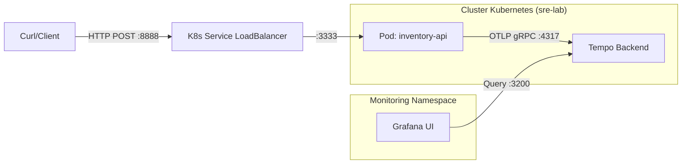

# Arquitetura v1: Direct Ingestion (App → Tempo)

**Data:** 07/01/2026  
**Autor:** Leandro Carpenter  
**Contexto:** SRE Observability Lab - Phase 8

---

## 1. Visão Geral

Nesta fase, implementamos a observabilidade básica utilizando o padrão de "Ingestão Direta". A aplicação instrumentada com OpenTelemetry envia os traces diretamente para o backend de armazenamento (Tempo), sem passar por intermediários (Collectors).

### Diagrama Lógico



---

## 2. Componentes da Stack

| Componente     | Função           | Versão/Imagem                 | Configuração Chave                        |
|----------------|------------------|-------------------------------|-------------------------------------------|
| Inventory API  | Aplicação Node.js| `inventory-api:v2`           | SDK OTel Node.js (`instrumentation.ts`)   |
| Grafana Tempo  | Trace Backend    | Helm Chart (Single Binary)   | Porta Query: `3200`, Protocolo: OTLP gRPC |
| Grafana        | Visualização     | Helm Chart                   | Datasource conectado via DNS interno      |

---

## 3. Configuração de Rede (Service Discovery)

A comunicação entre namespaces no Kubernetes foi resolvida via DNS interno:

### Endpoint de Envio (App → Tempo):

- **URL:** `http://tempo.monitoring.svc.cluster.local:4317`
- Definido via variável de ambiente: `OTEL_EXPORTER_OTLP_ENDPOINT`

### Endpoint de Leitura (Grafana → Tempo):

- **URL:** `http://tempo:3200`
- **Nota:** Resolução de nome curto possível pois Grafana e Tempo estão no mesmo namespace (`monitoring`).

---

## 4. Como Reproduzir

### Pré-requisitos

- Cluster K3s ativo.
- Namespaces `sre-lab` e `monitoring` criados.

### Instalação da Stack (Helm)

```bash
# Backend (Tempo)
helm install tempo grafana/tempo \
  --namespace monitoring \
  --set persistence.enabled=false \
  --set resources.requests.cpu=100m \
  --set resources.requests.memory=256Mi

# Frontend (Grafana)
helm install grafana grafana/grafana \
  --namespace monitoring \
  --set persistence.enabled=false \
  --set adminPassword='admin' \
  --set service.type=NodePort
```

### Build e Deploy da Aplicação

```bash
# Build da imagem (Local)
npm run build
docker build -t inventory-api:v2 .
docker save inventory-api:v2 | sudo k3s ctr images import -

# Deploy no Kubernetes
kubectl apply -f k8s/deployment.yaml
```

### Teste de Acesso

```bash
# 1. Gerar Tráfego (Via LoadBalancer simulado)
curl -i -X POST http://localhost:8888/inventory \
   -H "Content-Type: application/json" \
   -d '{"name": "Test-Doc", "type": "CONTAINER", "ipAddress": "10.0.0.1"}'

# 2. Acessar Grafana
kubectl port-forward -n monitoring svc/grafana 3000:80
# URL: http://localhost:3000
# Login: admin / admin
```

---

## 5. Limitações Conhecidas

1. **Acoplamento:** A aplicação precisa saber o endereço exato do backend (hardcoded ou via env específica do backend).

2. **Flexibilidade:** Mudar de vendor exige rebuild/redeploy da aplicação para trocar o Exporter no código ou configuração.

3. **Segurança:** As credenciais e endpoints ficam expostos diretamente no ambiente da aplicação.

---